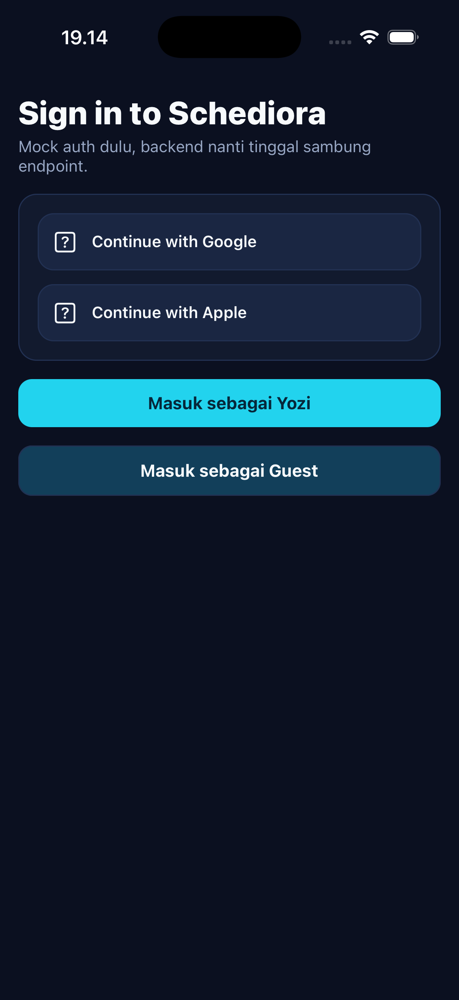
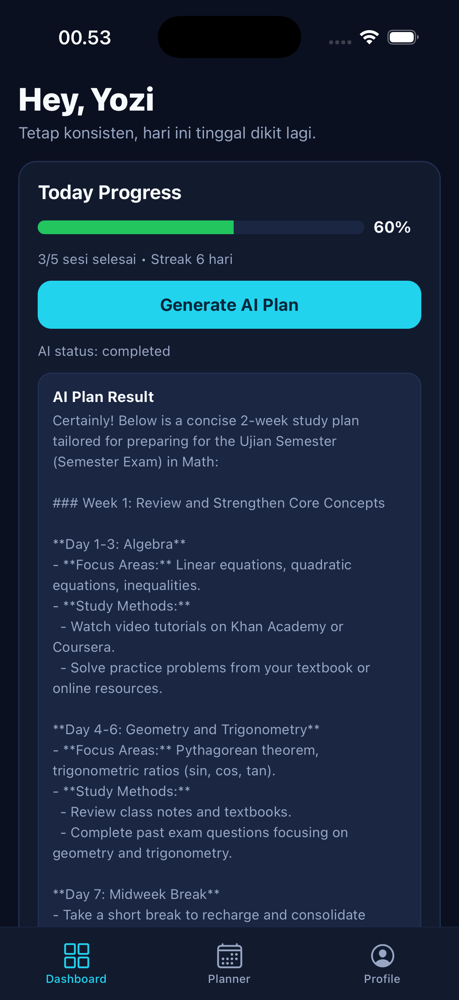
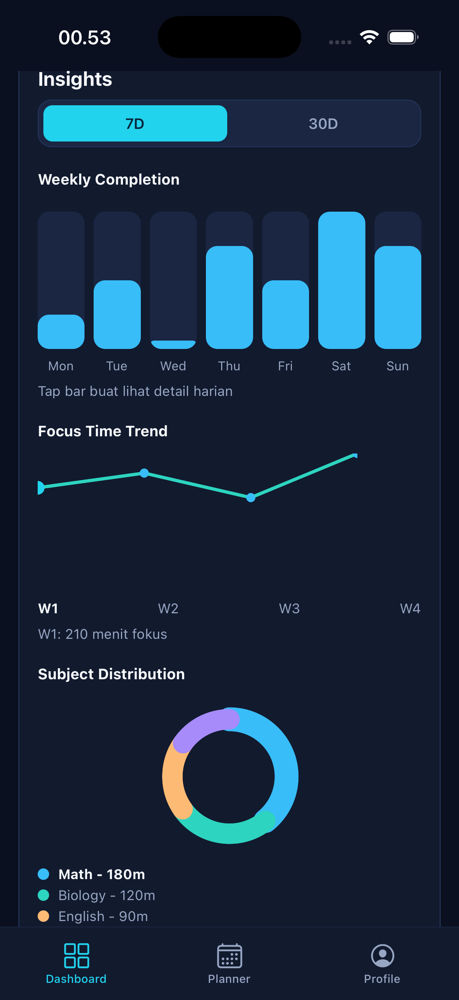
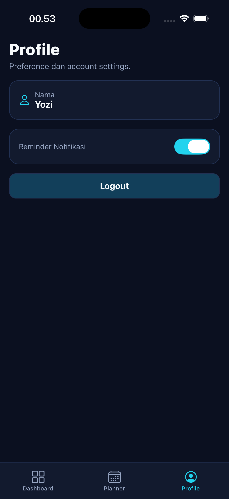
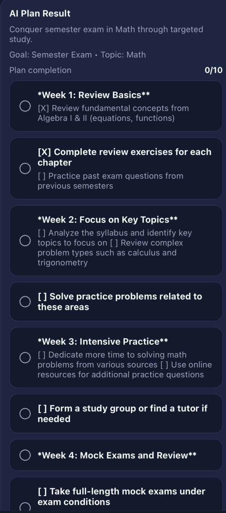
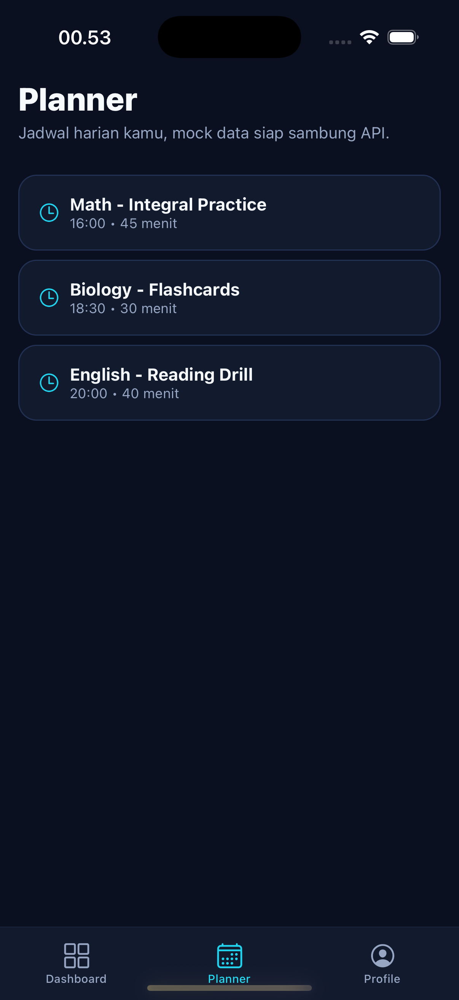
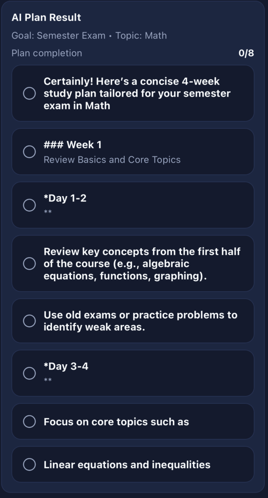

# Schediora

AI-powered mobile study planner built with React Native (frontend), FastAPI (backend), and Ollama for local model inference.

## Why Schediora

Schediora helps students:

- set study goals and learning preferences quickly
- generate weekly AI study plans
- execute tasks in planner views (timeline + board)
- track progress with live dashboard insights
- stay consistent using streak and focus metrics

## Core Capabilities

- Guided onboarding: goal, daily study hours, priority topics
- Email/password authentication with persistent session
- Dashboard summary from live `study_sessions` data
- Insight charts: weekly completion, focus trend, subject distribution (7D/30D)
- AI plan generation with async queue + polling
- Weekly AI generation lock (one generation window per week)
- AI plan persisted automatically into planner tasks
- Planner timeline and board views
- Manual task creation:
  - append to current weekly plan if it exists
  - create weekly plan if none exists
- Task status updates (`pending`, `in_progress`, `done`) with realtime dashboard refresh
- Profile screen with reminder toggle + logout
- Fully local AI runtime with Ollama

## App Preview

### Main Screens

| Login | Dashboard | Insights |
|---|---|---|
|  |  |  |

| Planner | AI Plan Result | Profile |
|---|---|---|
|  |  |  |

### AI Plan Rendering



## Tech Stack

- Frontend: React Native + TypeScript + Zustand + TanStack Query
- Backend: FastAPI + SQLAlchemy + Alembic + Celery + Redis + PostgreSQL
- AI Runtime: Ollama (`qwen2.5:7b` default)

## Requirements

- macOS (recommended for iOS development)
- Node.js >= 20
- Python >= 3.11
- Xcode + Command Line Tools
- CocoaPods
- Docker Desktop
- Homebrew

## Initial Setup

### 1. Clone

```bash
git clone <YOUR_REPOSITORY_URL>
cd Schediora
```

### 2. Backend Setup

```bash
cd backend
python3 -m venv .venv --upgrade-deps
source .venv/bin/activate
python -m ensurepip --upgrade || true
python -m pip install -U pip
python -m pip install fastapi "uvicorn[standard]" sqlalchemy "psycopg[binary]" alembic \
  pydantic-settings "python-jose[cryptography]" "passlib[argon2]" redis celery httpx \
  email-validator pytest pytest-asyncio ruff mypy
cp .env.example .env
```

Start infra and migrate:

```bash
docker compose up -d postgres redis
python -m alembic upgrade head
```

Run API:

```bash
python -m uvicorn app.main:app --reload --port 8000
```

Run worker (new terminal):

```bash
cd backend
source .venv/bin/activate
python -m celery -A app.workers.celery_app.celery_app worker -Q ai -l INFO
```

### 3. Local AI Setup (Ollama)

```bash
brew install ollama
ollama serve
```

In another terminal:

```bash
ollama pull qwen2.5:7b
```

### 4. Frontend Setup

```bash
cd mobile
npm install
cd ios && pod install
```

Run Metro:

```bash
cd mobile
npm start -- --reset-cache
```

Run app (new terminal):

```bash
cd mobile
npm run ios
```

## Verification

Backend health:

```bash
curl http://localhost:8000/api/v1/health/live
```

Worker task registration:

```bash
cd backend
source .venv/bin/activate
python -m celery -A app.workers.celery_app.celery_app inspect registered
```

Ollama model list:

```bash
ollama list
```

## Documentation

See `docs/README.md` for architecture docs, PRDs, and runbooks.
