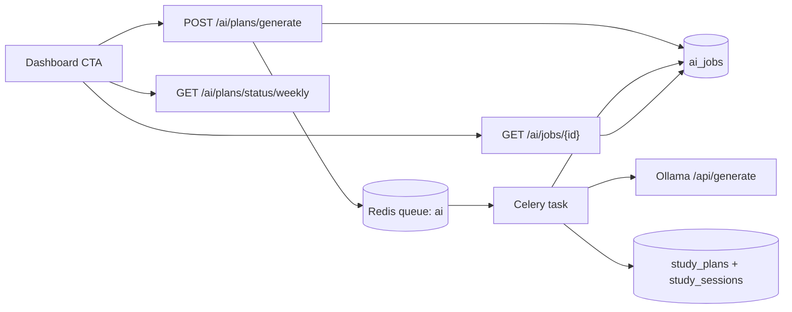

# Schediora AI Architecture (Local Ollama)

## 1. Flow

## 2. Components
- API route: `backend/app/api/v1/ai.py`
- Queue app: `backend/app/workers/celery_app.py`
- Worker task: `backend/app/workers/tasks/ai_tasks.py`
- Ollama client: `backend/app/services/ai_service.py`

## 3. Queue Contract
- Task name: `app.workers.tasks.ai_tasks.generate_plan_task`
- Queue: `ai`
- Worker start command:
  - `python -m celery -A app.workers.celery_app.celery_app worker -Q ai -l INFO`

## 4. Failure Modes
- Ollama unreachable -> `failed` status + error persisted.
- Missing task registration -> worker drops messages.
- Queue mismatch -> jobs remain queued.
- Weekly lock active -> generate endpoint returns `409` (expected).

## 5. Runtime Verification
- `inspect registered` includes AI task.
- Worker logs show `Task ... received`.
- Job endpoint transitions to `completed` with `result` and `result_structured`.
- Planner sessions exist after completion (`GET /sessions?week=current`).
