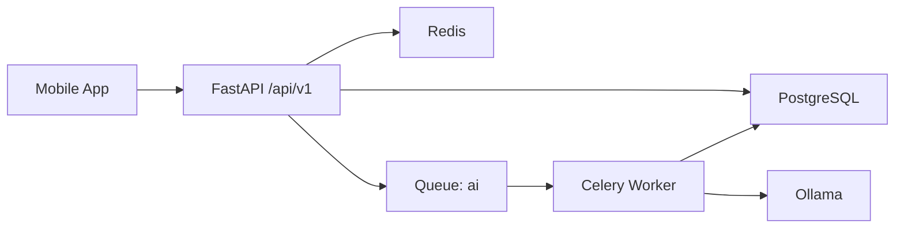

# Schediora Backend Architecture (FastAPI)

## 1. Architecture Style
- Modular monolith + asynchronous worker queue.

## 2. Stack
- FastAPI
- PostgreSQL (+ pgvector-ready)
- Redis
- Celery
- SQLAlchemy 2 + Alembic
- Pydantic v2
- Passlib Argon2
- Ollama local model runtime

## 3. Runtime Topology

## 4. Request Flows
### Sync flow
1. API route validates input.
2. Service/repository reads or writes DB.
3. Typed response returned.

### Async AI flow
1. API checks weekly planner lock (current week).
2. API creates `ai_jobs` record (`queued`) and enqueues `generate_plan_task`.
3. Worker consumes queue `ai`, sets `running`.
4. Worker calls Ollama and normalizes structured result.
5. Worker persists generated tasks into `study_plans` + `study_sessions`.
6. Job status becomes `completed` or `failed`.

### Planner status flow
1. Planner updates session status via `PATCH /sessions/{id}`.
2. API updates `study_sessions.status`.
3. API syncs parent `study_plans.status`.
4. Dashboard summary endpoint reflects latest values from sessions.

## 5. Layer Boundaries
- Router: HTTP concerns only.
- Service: business logic.
- Repository/model: persistence logic.
- Worker: async orchestration.

## 6. Operational Rules
- Worker must run with queue `ai`.
- Celery app must include AI task module.
- Migrations are mandatory for schema changes.

## 7. Observability
- Structured logging.
- `health/live` and `health/ready` endpoints.
- Worker logs for task receive and completion.
- AI lock and persistence behavior verifiable through:
  - `GET /api/v1/ai/plans/status/weekly`
  - `GET /api/v1/sessions?week=current`

## 8. Testing Strategy
- Unit tests for service logic.
- Integration tests for API + DB.
- Worker-path verification for AI jobs.
