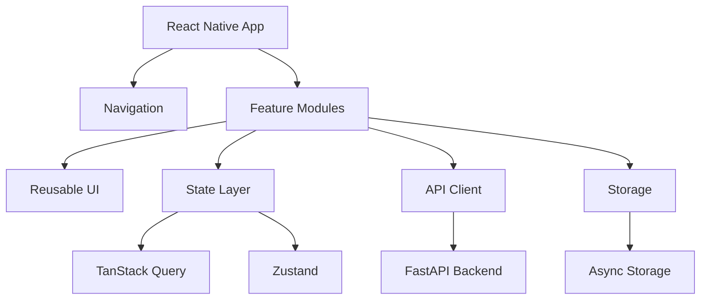

# Schediora Frontend Architecture (React Native)

## 1. Architecture Principles
- Feature-based modular structure.
- Strong typing across API and view models.
- Reusable design system components.
- Clear separation of server state and UI state.

## 2. High-Level Design


## 3. Folder Layout
```text
mobile/src/
  app/
    navigation/
    providers/
    theme/
  features/
    auth/
    onboarding/
    dashboard/
    planner/
    profile/
  shared/
    components/
    services/api/
    services/storage/
    types/
```

## 4. Navigation
- Root stack:
  - Bootstrapping
  - Onboarding
  - Auth
  - Main tabs
- Main tabs:
  - Dashboard
  - Planner
  - Profile

## 5. State Strategy
- TanStack Query:
  - backend data and cache lifecycle.
- Zustand:
  - session/auth state and UI-local state.

## 6. API Design
- `apiRequest()` wrapper with timeout and typed errors.
- Bearer token support in request headers.
- Feature-level API modules:
  - `features/auth/api`
  - `features/dashboard/api`
  - `features/planner/api`

## 7. Current API Integration Status
- Integrated:
  - `auth/register`, `auth/login`, `auth/refresh`, `auth/logout`, `users/me`
  - `ai/plans/generate`, `ai/jobs/{id}`, `ai/plans/status/weekly`
  - `dashboard/summary?range=7d|30d`
  - `sessions?week=current|all` (planner source of truth)
  - `plans` (manual plan create fallback)
  - `plans/current/sessions` (append manual task to current weekly plan)
  - `sessions/{id}` status update
- Behavior contracts:
  - AI generation is available only when weekly planner is not set.
  - AI result is persisted into planner tasks.
  - Dashboard and planner data are invalidated/refetched after task mutations.

## 8. Error Handling
- API error normalization via `ApiError`.
- Explicit UI states for request progress and failures.
- Auto-refresh fallback during auth bootstrap.

## 9. Security
- Access and refresh tokens stored in Async Storage.
- Token rotation through refresh endpoint.
- Logout clears local credentials.

## 10. Testing
- Lint for code consistency.
- Jest for render and integration-safe mocks.
- Native module mocks for AsyncStorage and font files.

## 11. Definition of Done
- Type-safe API integration.
- No crashes in core flows.
- Lint and tests passing.
- Complete state coverage (loading/empty/error/success).
